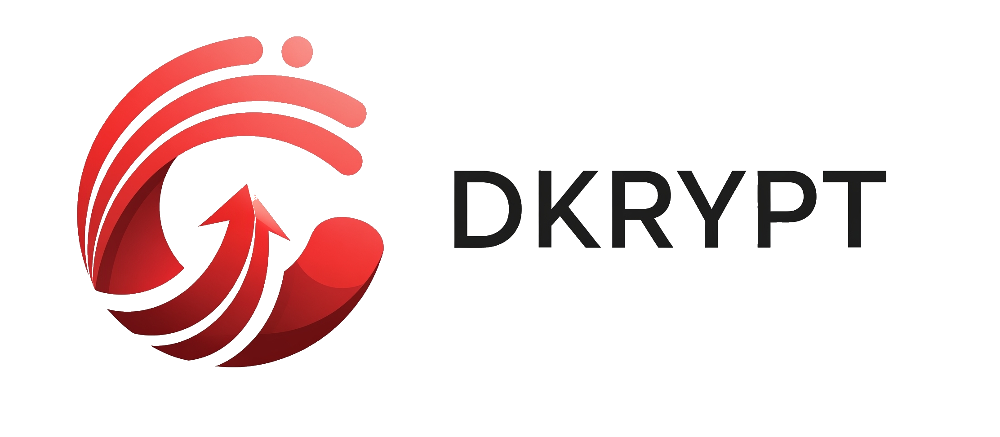

<p align="center">
<a href="#"></a>
</p>

<em><h5 align="center">Developed by Rafacuy (arazz.)</h5></em>

<p align="center">
    <a href="#">
        
    </a>
    <a href="#">
        
    </a>
    <a href="#">
        
    </a>
    <a href="https://github.com/Rafacuy/DKrypt/issues">
        
    </a>
</p>


<h1 align="center">Introduction</h1>
DKrypt is an advanced, all-in-one penetration testing framework designed for security professionals, ethical hackers, and IT administrators. Built with modularity and efficiency at its core, DKrypt integrates cutting-edge reconnaissance, vulnerability scanning, and exploitation tools into a unified command-line interface. With its real-time visualization and intelligent automation, DKrypt transforms complex security assessments into streamlined workflows.

## _Features_
- **Directory Bruteforcer**: _Discover hidden directories on target web servers._
- **Subdomain Discovery**: _Identify subdomains using a wordlist-based scanner._
- **Security Header Audit**: _Analyze HTTP response headers for security best practices._
- **SSL/TLS Inspector**: _Get deep insights into SSL/TLS certificate configurations._
- **Website Scraper**: _Extract page content and links quickly._
- **Website Vulnerability Scanner**: _Detect common web application vulnerabilities._
- **Admin Page Finder**: _Discover admin page on the target web servers._
- **Port Scanner**: _Discover hidden port on the target website._

---

## Installation

1. **Clone the Repository**
```bash
git clone https://github.com/Rafacuy/DKrypt.git
cd DKrypt
```

2. **Install Dependencies**
```bash
bash install.sh
```
Or install the `requirements.txt` directly:
```bash
pip install -r requirements.txt
```

3. **Run DKrypt**
```bash
python main.py
```

### Trouble installing on Termux?

If you're facing issues with `cryptography` or build tools, just run:
```bash
bash FIX.sh # Only for termux users
```
This script will auto-install Termux dependencies for you.

---

## Requirements
- Python 3.8+
- `rich`, `requests`, `beautifulsoup4`, and other libraries listed in `requirements.txt`

## Wordlists
Custom wordlists for:

* Directory brute-forcing

* Subdomain enumeration

* Admin panel discovery

_Located in /wordlists/_

## Contributing
Pull requests are welcome! If you find bugs or want to suggest features, open an issue or fork the repo and submit a PR.
Also you can chat me casualy on My [TikTok](https://tiktok.com/@rafardhancuy) account.

## Author
Copyright (C) 2025 Rafacuy (arazz.) 

### _Contact_
- **Telegram**: [@ArashCuy](https://t.me/@ArashCuy)
- **TikTok**: [@rafardhancuy](https://tiktok.com/@rafardhancuy)
- **GitHub**: [@Rafacuy](https://github.com/Rafacuy)


## License
This tool is under the GPL-3.0 License. See the [LICENSE](./LICENSE) for details.

---


